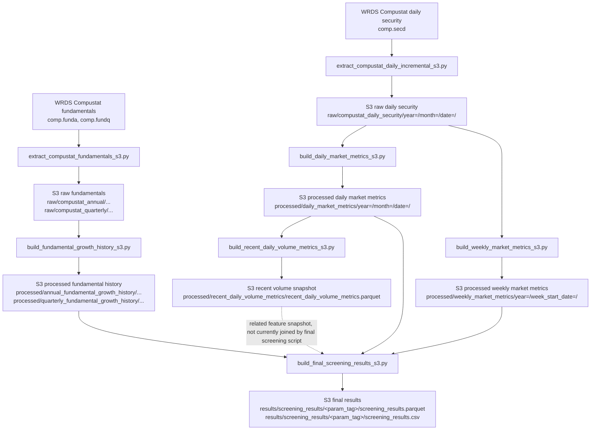

# Full Pipeline Data Flow

## Project Overview

This repository implements an EC2 and S3 backed NASDAQ stock screening data pipeline. It extracts raw Compustat data from WRDS, writes raw Parquet files to S3, builds processed feature tables with DuckDB, and produces final screening result files under a parameterized `results/` prefix.

The current production-style entry point is:

```bash
python3 server_pipeline/run_full_pipeline.py
```

For EC2, use:

```bash
bash scripts/run_full_pipeline_ec2.sh
```

The runner supports:

```bash
python3 server_pipeline/run_full_pipeline.py --skip-wrds
python3 server_pipeline/run_full_pipeline.py --only extraction
python3 server_pipeline/run_full_pipeline.py --only transform
python3 server_pipeline/run_full_pipeline.py --only screening
```

`--skip-wrds` is useful after raw WRDS data already exists in S3.

## Architecture Summary

The pipeline follows a simple lake-style layout:

| Layer | Purpose | S3 prefix |
|---|---|---|
| Raw | WRDS extracts with minimal feature processing | `raw/` |
| Processed | Reusable feature tables for fundamentals, daily market metrics, weekly market metrics, and recent volume | `processed/` |
| Results | Parameterized final screening outputs | `results/` |

Central configuration lives in [`server_pipeline/config.py`](../server_pipeline/config.py). The default bucket is `nasdaq-stock-recommendation`; the default AWS region is `ap-northeast-2`, with overrides through `AWS_REGION` or `AWS_DEFAULT_REGION`.

WRDS authentication is handled by [`server_pipeline/utils/wrds_connection.py`](../server_pipeline/utils/wrds_connection.py). It requires `WRDS_USERNAME` in the environment and reads the password through `~/.pgpass`; no WRDS password is stored in code.

DuckDB S3 access is configured in [`server_pipeline/s3_duckdb.py`](../server_pipeline/s3_duckdb.py). It installs/loads DuckDB `httpfs`, uses boto3 credentials, and sets DuckDB `s3_region` to the same configured AWS region.

## Full Pipeline Order

This is the actual order defined in [`server_pipeline/run_full_pipeline.py`](../server_pipeline/run_full_pipeline.py).

| Step | Script | Category | Input source | Output path | Format | Grain | Partitioned | Validation checks |
|---:|---|---|---|---|---|---|---|---|
| 1 | `server_pipeline/fundamentals/extract_compustat_fundamentals_s3.py` | Extraction | WRDS `comp.funda`, `comp.fundq`, filtered by active NASDAQ securities from `comp.secd` | `raw/compustat_annual/extract_date=YYYY-MM-DD/compustat_annual.parquet`; `raw/compustat_annual/latest/compustat_annual.parquet`; `raw/compustat_quarterly/extract_date=YYYY-MM-DD/compustat_quarterly.parquet`; `raw/compustat_quarterly/latest/compustat_quarterly.parquet` | Parquet | Annual: `gvkey, fyear`; quarterly: `gvkey, fyearq, fqtr` | Versioned by `extract_date`; stable `latest` snapshot | Row counts, unique GVKEYs, fiscal/date ranges, missing key measures, duplicate annual/quarterly keys |
| 2 | `server_pipeline/daily/extract_compustat_daily_incremental_s3.py` | Extraction | WRDS `comp.secd` latest trading dates | `raw/compustat_daily_security/year=YYYY/month=MM/date=YYYY-MM-DD/compustat_daily_security_YYYY-MM-DD.parquet` | Parquet | `gvkey, iid, date` | Yes, by year/month/date | Latest dates printed, rows per date, unique tickers, empty-date warning |
| 3 | `server_pipeline/fundamentals/build_fundamental_growth_history_s3.py` | Transformation | Raw annual and quarterly `latest` fundamentals | `processed/annual_fundamental_growth_history/annual_fundamental_growth_history.parquet`; `processed/quarterly_fundamental_growth_history/quarterly_fundamental_growth_history.parquet` | Parquet | Annual: `gvkey, fyear`; quarterly: `gvkey, fyearq, fqtr` | No, single feature history files | Row counts, unique GVKEYs, ranges, valid growth-pair counts, duplicate key counts |
| 4 | `server_pipeline/daily/build_daily_market_metrics_s3.py` | Feature engineering | Raw daily security files, including yearly warm-up files and date-partitioned daily raw files | `processed/daily_market_metrics/year=YYYY/month=MM/date=YYYY-MM-DD/daily_market_metrics_YYYY-MM-DD.parquet` | Parquet | `gvkey, iid, date` | Yes, by year/month/date | Selected raw files, target dates, row counts, unique tickers, date range, duplicate `gvkey/iid/date`, flag counts |
| 5 | `server_pipeline/daily/build_weekly_market_metrics_s3.py` | Feature engineering | Raw daily security files | `processed/weekly_market_metrics/year=YYYY/week_start_date=YYYY-MM-DD/weekly_market_metrics_YYYY-MM-DD.parquet` | Parquet | `gvkey, iid, week_start_date` | Yes, by year/week_start_date | Duplicate ticker-week, duplicate security-week, one week end per week start, ticker coverage warning, legacy `week_end_date` cleanup logging |
| 6 | `server_pipeline/daily/build_recent_daily_volume_metrics_s3.py` | Feature engineering | Date-partitioned daily market metrics | `processed/recent_daily_volume_metrics/recent_daily_volume_metrics.parquet` | Parquet | `gvkey, iid, date` inside recent window | No, intentionally one snapshot file | Daily partition count, output rows, unique tickers, date range, latest date |
| 7 | `server_pipeline/screening/build_final_screening_results_s3.py` | Screening | Daily market metrics, weekly market metrics, annual growth history, quarterly growth history | `results/screening_results/<param_tag>/screening_results.parquet`; `results/screening_results/<param_tag>/screening_results.csv` | Parquet and CSV | `gvkey, iid` at one screening date | Yes, by screening parameter folder | Output rows, screening date, unique tickers, counts for flags A/B/AB/C/D/CD/E/F/G/H/all |

## Data Lineage Diagram



## Data Layer Explanation

### `raw/`

The raw layer stores WRDS extracts with lightweight normalization only. Daily raw files include adjusted close price computed from raw close and adjustment factor, but the main purpose is to preserve source-like data in S3.

### `processed/`

The processed layer stores reusable feature tables:

- Fundamental growth history from annual and quarterly fundamentals.
- Daily market indicators and daily helper flags.
- Weekly market indicators and weekly helper flags.
- Recent daily volume snapshot used as a compact feature layer.

### `results/`

The results layer stores parameterized screening outputs. A folder such as `n10_annual3_quarter4_q5_m3` identifies the screening thresholds used to produce that output.

## Step-By-Step Processing

### A. WRDS Raw Data Extraction

`server_pipeline/fundamentals/extract_compustat_fundamentals_s3.py` extracts annual fundamentals from WRDS `comp.funda` and quarterly fundamentals from WRDS `comp.fundq`. Both queries restrict records to industrial, consolidated, standard-format data and to GVKEYs seen in active NASDAQ securities from `comp.secd` where `exchg = 14`, `secstat = 'A'`, and `tpci = '0'`.

Important annual fields include `gvkey`, `datadate`, `fyear`, `ticker`, `company_name`, `sale`, `revt`, `oiadp`, `at`, `csho`, `prcc_f`, and `mkvalt`.

Important quarterly fields include `gvkey`, `datadate`, `fyearq`, `fqtr`, `ticker`, `company_name`, `saleq`, `revtq`, `oiadpq`, `atq`, `cshoq`, `prccq`, and `mkvaltq`.

The script writes both versioned extract files and stable `latest` files. `latest` means the current canonical raw fundamentals snapshot used by downstream processing:

```text
raw/compustat_annual/latest/compustat_annual.parquet
raw/compustat_quarterly/latest/compustat_quarterly.parquet
```

`server_pipeline/daily/extract_compustat_daily_incremental_s3.py` extracts latest daily security rows from WRDS `comp.secd`. It first asks WRDS for the most recent trading dates, then downloads each date and writes date-partitioned raw Parquet:

```text
raw/compustat_daily_security/year=YYYY/month=MM/date=YYYY-MM-DD/compustat_daily_security_YYYY-MM-DD.parquet
```

### B. Fundamental Growth History

`server_pipeline/fundamentals/build_fundamental_growth_history_s3.py` reads the annual and quarterly `latest` raw files from S3.

Annual growth is calculated at `gvkey, fyear` grain. The script uses `COALESCE(sale, revt)` as annual revenue and `oiadp` as annual operating income. It deduplicates annual rows with `ROW_NUMBER() OVER (PARTITION BY gvkey, fyear ORDER BY datadate DESC)` and keeps `rn = 1`. It then calculates year-over-year revenue and operating income growth with `LAG(...)` over each GVKEY ordered by fiscal year.

Quarterly growth is calculated at `gvkey, fyearq, fqtr` grain. The script uses `COALESCE(saleq, revtq)` as quarterly revenue and `oiadpq` as quarterly operating income. It deduplicates by `gvkey, fyearq, fqtr`, then joins each quarter to the same quarter in the prior fiscal year.

The outputs are single history files:

```text
processed/annual_fundamental_growth_history/annual_fundamental_growth_history.parquet
processed/quarterly_fundamental_growth_history/quarterly_fundamental_growth_history.parquet
```

Both outputs include rank fields (`annual_rank_desc`, `quarterly_rank_desc`) so final screening can select recent annual or quarterly windows.

### C. Daily Market Metrics

`server_pipeline/daily/build_daily_market_metrics_s3.py` reads raw daily security files from S3. It selects a target set of recent trading dates and a warm-up window long enough to calculate moving averages. It includes yearly raw files for historical warm-up where needed and date-partitioned raw files for 2026 and later.

Daily metrics are calculated at `gvkey, iid, date` grain. The script deduplicates source rows by `gvkey, iid, date`, calculates:

- `ma20`, `ma50`, `ma100`
- `volume_ma30`, excluding the current day
- `volume_ratio`
- daily moving-average ratio fields
- `daily_ma_cluster_ratio`
- helper `flag_e`
- helper `flag_f`

The output is partitioned by trading date:

```text
processed/daily_market_metrics/year=YYYY/month=MM/date=YYYY-MM-DD/daily_market_metrics_YYYY-MM-DD.parquet
```

### D. Weekly Market Metrics

`server_pipeline/daily/build_weekly_market_metrics_s3.py` builds weekly indicators from raw daily security data. Weekly metrics exist because some screening conditions are based on weekly moving averages and weekly moving-average crossover behavior, which is distinct from daily price/volume behavior.

The output grain is one row per `gvkey, iid, week_start_date`.

The fixed weekly partitioning logic uses `week_start_date` as the stable S3 partition key:

```text
processed/weekly_market_metrics/year=YYYY/week_start_date=YYYY-MM-DD/weekly_market_metrics_YYYY-MM-DD.parquet
```

The file still keeps:

- `week_end_date`: market-wide latest available trading date in that calendar week.
- `security_week_last_trade_date`: latest available trading date for that security in that week.
- `data_as_of_date`: latest raw daily date used by the build.

This design prevents the same calendar week from producing multiple physical folders as new trading days arrive. For example, a week can update from Wednesday to Thursday internally through `week_end_date` and `data_as_of_date`, while the physical partition remains the same `week_start_date=...` folder.

The script avoids duplicate weekly rows by ranking daily rows within `gvkey, iid, DATE_TRUNC('week', date)` and keeping the latest row in each week. It validates duplicate ticker-week and duplicate security-week keys, checks that each `week_start_date` has only one `week_end_date`, and warns if completed weekly partitions have unusually low ticker coverage.

The script can also clean old legacy `week_end_date=...` prefixes:

```bash
python3 server_pipeline/daily/build_weekly_market_metrics_s3.py --cleanup-legacy-week-end
```

### E. Recent Daily Volume Metrics

`server_pipeline/daily/build_recent_daily_volume_metrics_s3.py` scans the date-partitioned daily market metrics and creates a recent-volume feature snapshot over the latest configurable lookback window. The default is three months.

This step intentionally writes one single feature snapshot file:

```text
processed/recent_daily_volume_metrics/recent_daily_volume_metrics.parquet
```

It is different from `daily_market_metrics` and `weekly_market_metrics`. Those are time-series feature tables partitioned by date/week. `recent_daily_volume_metrics` is a compact feature layer for recent volume analysis and screening support; it stores recent rows with `latest_date` and `window_start_date` columns so consumers can see the snapshot window.

### F. Final Screening Results

`server_pipeline/screening/build_final_screening_results_s3.py` joins four S3-backed inputs:

- Date-partitioned daily market metrics.
- Week-start-partitioned weekly market metrics.
- Annual fundamental growth history.
- Quarterly fundamental growth history.

The final script writes:

```text
results/screening_results/<param_tag>/screening_results.parquet
results/screening_results/<param_tag>/screening_results.csv
```

By default, these main output files apply a universe-quality filter that removes likely non-operating securities such as SPACs, acquisition companies, redeemable securities, warrants, rights, and units. The filter is applied only in the final screening layer; raw and processed data remain unfiltered for auditability.

The default parameter folder is:

```text
n10_annual3_quarter4_q5_m3
```

This means:

- `n10`: revenue and operating income growth threshold is 10 percent.
- `annual3`: require three recent annual YoY growth observations for flag A.
- `quarter4`: require four recent quarterly YoY growth observations for flag B.
- `q5`: volume surge threshold is volume ratio >= 5.
- `m3`: require at least three surge days in the recent three-month window for flag D.

Major final flags:

| Flag | Meaning in code |
|---|---|
| `flag_a` | Annual revenue and operating income growth meet the configured `n_pct` threshold for the configured annual lookback count. |
| `flag_b` | Quarterly revenue and operating income growth meet the configured `n_pct` threshold for the configured quarterly lookback count. |
| `flag_ab` | Both `flag_a` and `flag_b` are true. |
| `flag_c` | Latest daily `volume_ratio` is at least `q`. |
| `flag_d` | Count of recent surge days with `volume_ratio >= q` is at least `m`. |
| `flag_cd` | Both `flag_c` and `flag_d` are true. |
| `flag_e` | Daily moving averages are clustered within the helper threshold from the daily metrics step. |
| `flag_f` | Daily moving-average crossover helper flag from the daily metrics step. |
| `flag_g` | Weekly moving averages are clustered within the helper threshold from the weekly metrics step. |
| `flag_h` | Weekly moving-average crossover helper flag from the weekly metrics step. |
| `flag_all` | `flag_a`, `flag_b`, `flag_c`, `flag_d`, `flag_f`, and `flag_h` are all true. |

The default strict screening can return zero full-pass `flag_all` candidates. That is not necessarily a pipeline failure. Intermediate flag counts such as `flag_ab`, `flag_cd`, `flag_f`, or `flag_h` still show that each signal component is producing output. Relaxed screening parameters can be used to inspect broader candidate sets.

### Universe-Quality Filter

The universe-quality filter is implemented in `server_pipeline/screening/build_final_screening_results_s3.py` after the full candidate table is built and before the main output is written.

The filter currently checks available text fields including `ticker`, `company_name`, and `iid`. It excludes rows matching specific security-type patterns:

- `-REDH` or `REDH`
- `REDEEM` or `REDEEMABLE`
- `WARRANT` or `WARRANTS`
- `RIGHT` or `RIGHTS`
- `UNIT` or `UNITS`
- `ACQUISITION`, `ACQ`, `ACQ.`, `ACQUTN`
- `BLANK CHECK`
- `SPAC`

The filter intentionally does not use broad words such as `CAPITAL`, because those can appear in normal operating company names.

The script adds two audit columns before filtering:

- `is_excluded_universe`
- `exclusion_reason`

Main filtered outputs:

```text
results/screening_results/<param_tag>/screening_results.parquet
results/screening_results/<param_tag>/screening_results.csv
```

Excluded-universe audit outputs:

```text
results/screening_results/<param_tag>/excluded_universe/excluded_universe.parquet
results/screening_results/<param_tag>/excluded_universe/excluded_universe.csv
```

Screening summary output:

```text
results/screening_results/<param_tag>/screening_summary.json
```

The summary includes row counts before and after filtering, excluded row count, flag counts before and after filtering, `flag_all` counts, and top exclusion reasons.

To disable the filter for comparison:

```bash
python3 server_pipeline/screening/build_final_screening_results_s3.py --disable-universe-filter
```

To also write unfiltered comparison snapshots:

```bash
python3 server_pipeline/screening/build_final_screening_results_s3.py --write-unfiltered-audit
```

Unfiltered comparison snapshots are written to:

```text
results/screening_results/<param_tag>/unfiltered/screening_results_unfiltered.parquet
results/screening_results/<param_tag>/unfiltered/screening_results_unfiltered.csv
```

## Data Grain Table

| Dataset | Grain |
|---|---|
| Raw annual fundamentals | `gvkey, fyear` after downstream deduplication |
| Raw quarterly fundamentals | `gvkey, fyearq, fqtr` after downstream deduplication |
| Raw daily security | `gvkey, iid, date` |
| Annual growth history | `gvkey, fyear` |
| Quarterly growth history | `gvkey, fyearq, fqtr` |
| Daily market metrics | `gvkey, iid, date` |
| Weekly market metrics | `gvkey, iid, week_start_date` |
| Recent daily volume metrics | `gvkey, iid, date` within latest snapshot window |
| Final screening results | `gvkey, iid` at one `screening_date` |

## S3 Output Table

| Output | Path pattern | Partitioning |
|---|---|---|
| Annual fundamentals raw extract | `raw/compustat_annual/extract_date=YYYY-MM-DD/compustat_annual.parquet` | Extract date |
| Annual fundamentals latest | `raw/compustat_annual/latest/compustat_annual.parquet` | Stable latest file |
| Quarterly fundamentals raw extract | `raw/compustat_quarterly/extract_date=YYYY-MM-DD/compustat_quarterly.parquet` | Extract date |
| Quarterly fundamentals latest | `raw/compustat_quarterly/latest/compustat_quarterly.parquet` | Stable latest file |
| Daily security raw | `raw/compustat_daily_security/year=YYYY/month=MM/date=YYYY-MM-DD/compustat_daily_security_YYYY-MM-DD.parquet` | Year/month/date |
| Annual growth history | `processed/annual_fundamental_growth_history/annual_fundamental_growth_history.parquet` | Single file |
| Quarterly growth history | `processed/quarterly_fundamental_growth_history/quarterly_fundamental_growth_history.parquet` | Single file |
| Daily market metrics | `processed/daily_market_metrics/year=YYYY/month=MM/date=YYYY-MM-DD/daily_market_metrics_YYYY-MM-DD.parquet` | Year/month/date |
| Weekly market metrics | `processed/weekly_market_metrics/year=YYYY/week_start_date=YYYY-MM-DD/weekly_market_metrics_YYYY-MM-DD.parquet` | Year/week_start_date |
| Recent daily volume metrics | `processed/recent_daily_volume_metrics/recent_daily_volume_metrics.parquet` | Single snapshot file |
| Final screening Parquet | `results/screening_results/<param_tag>/screening_results.parquet` | Parameter folder |
| Final screening CSV | `results/screening_results/<param_tag>/screening_results.csv` | Parameter folder |
| Excluded universe audit | `results/screening_results/<param_tag>/excluded_universe/excluded_universe.parquet`; `results/screening_results/<param_tag>/excluded_universe/excluded_universe.csv` | Parameter folder |
| Screening summary | `results/screening_results/<param_tag>/screening_summary.json` | Parameter folder |
| Optional unfiltered comparison | `results/screening_results/<param_tag>/unfiltered/screening_results_unfiltered.parquet`; `results/screening_results/<param_tag>/unfiltered/screening_results_unfiltered.csv` | Parameter folder |

## Validation Checks Table

| Step | Validation output |
|---|---|
| Fundamentals extraction | Row counts, unique GVKEYs, fiscal/date ranges, missing revenue/income fields, duplicate key counts |
| Daily extraction | Latest trading dates, row count, unique ticker count, empty-date warning |
| Fundamental growth history | Row counts, unique GVKEYs, ranges, valid growth-pair counts, duplicate annual/quarterly keys |
| Daily market metrics | Selected files, target dates, output rows, unique tickers, date range, duplicate `gvkey/iid/date`, helper flag counts |
| Weekly market metrics | Selected files, row counts, unique tickers, week ranges, duplicate ticker-week, duplicate `gvkey/iid/week_start_date`, one week end per week start, ticker coverage warning, old prefix cleanup logging |
| Recent daily volume metrics | Number of input daily partitions, output rows, unique tickers, date range, latest date |
| Final screening | Input partition counts, parameter values, row counts before and after universe filtering, excluded-universe count, screening date, unique tickers, counts for every screening flag before and after filtering, top exclusion reasons |

## Known Design Choices

- `weekly_market_metrics` is partitioned by `week_start_date` because it is a time-series feature table and the partition must remain stable while the current week updates.
- `recent_daily_volume_metrics` is intentionally kept as a single feature snapshot file because it represents the current recent-volume feature layer for downstream inspection and screening support.
- The final screening default thresholds are strict and can return zero `flag_all` candidates.
- Relaxed screening parameters can be used to inspect broader candidate sets, for example lower `--n-pct`, lower `--q`, or shorter annual/quarterly lookbacks.
- The universe-quality filter is applied in the final screening layer, not during raw extraction, so excluded securities remain auditable in raw and processed data.
- `server_pipeline/` is the current EC2/S3-backed implementation. Some files under `scripts/` are older local utilities or one-off checks and are not part of the current full runner.

## Current Limitations

- The extraction steps require WRDS network access, `WRDS_USERNAME`, and a correctly permissioned `~/.pgpass`.
- Daily and weekly market metrics are incremental by default. Larger historical rebuilds require explicit arguments, such as `--start-week-date` for weekly metrics.
- `recent_daily_volume_metrics` is produced as a snapshot file, not a partitioned historical feature table.
- The final screening script currently joins daily metrics, weekly metrics, and fundamental growth histories directly; the recent volume snapshot is produced as a supporting feature layer but is not currently a separate input to the final screening SQL.
- The default final screen can be too strict for demonstration if no `flag_all` candidates appear.
- The universe-quality filter is regex based and uses available text fields. It is configurable and auditable, but it may still require occasional review as new security naming patterns appear.

## Next Improvement Ideas

- Add a lightweight data quality report that summarizes S3 row counts and date coverage after each full run.
- Add a relaxed-parameter screening example to the runbook for portfolio demos.
- Add CI checks for import/compile validation and simple static checks.
- Add optional historical rebuild commands for daily and weekly processed features.
- Consider a final HTML or notebook report that displays top candidates and intermediate flag counts without exposing secrets.
